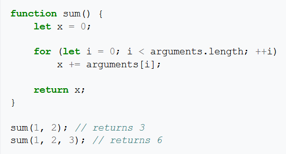
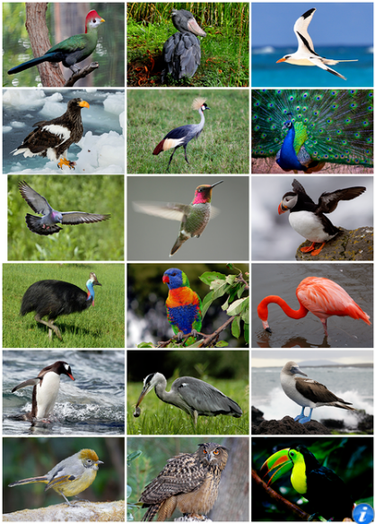

# Tâche impossible

## But de l'exercice

Apprendre à classifier une tâche selon son ou ces domaines de compétence.

## Matériel nécessaire

- Papier, Crayon

## Donnée de l'exercice

Faire correspondre la liste des domaines possibles avec les tâches mentionnées ci-dessous.

## Contenu de l'exercice

Liste des domaines possibles:

- 🧠 IA
- 🎓 Apprentissage automatique (Machine Learning)
- 💻 Informatique
- ➗ Maths
- 🤖 Robotique
- 💿 Science des données
- 📈 Statistiques

|                                                                                                                                                                                                               | Tâches                                                                             | Domaine                 |
| ------------------------------------------------------------------------------------------------------------------------------------------------------------------------------------------------------------- | ---------------------------------------------------------------------------------- | ----------------------- |
|                                                                                                                                                    | Programmer une application                                                         | ....................... |
|                                                                        | Trouver le résultat d'une équation de 2ème degré                                   | ....................... |
|  | Concevoir un rover automatisé pour l'exploration pour Mars                         | ....................... |
|                                                                                       | Créer une application permettant de localiser une photo ...                        | ....................... |
|                                                                                                                                                                     | ... et de savoir si le sujet est un oiseau                                         | ....................... |
|                                                                                                     | Trouver la meilleur solution de stockage pour les données d'une entreprise         | ....................... |
|                                                               | Extrapoler le pourcentage de population qui aime le chocolat à partir d'un sondage | ....................... |
|                                                                                                                     | Prédire l'évolution du prix de l'or                                                | ....................... |

 

